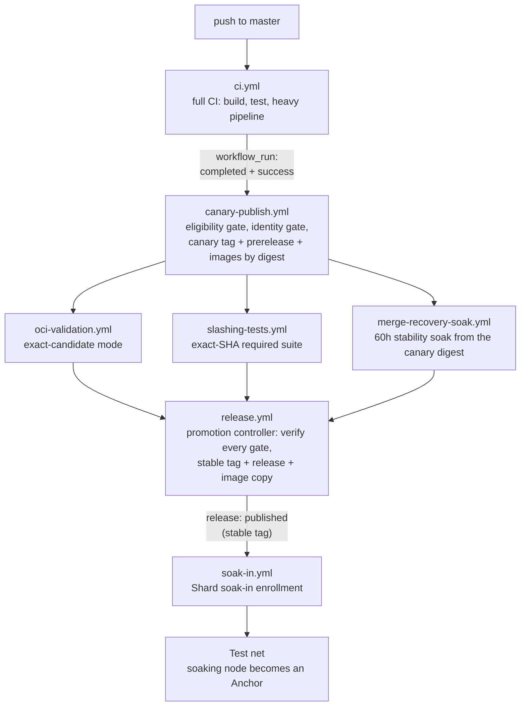

# Contributing

Thanks for contributing to a [F1R3FLY.io](https://github.com/F1R3FLY-io) project. Org-wide
policy lives in [F1R3FLY-io/.github](https://github.com/F1R3FLY-io/.github); anything here
that conflicts defers to it.

## Before You Start

1. Read the repo's `README.md` (and `DEVELOPER.md` if present).
2. Check open GitHub Issues and Pull Requests — the work may already be claimed or in progress.
3. For non-trivial changes, open a GitHub Issue or Discussion first so design can be agreed
   before implementation.
4. For protocol- or ecosystem-level proposals, file a [FIP](https://github.com/F1R3FLY-io/FIPS)
   rather than a PR.

## Branching and Commits

- Branch from `dev` and open pull requests against `dev`. Maintainers promote
  `dev` → `master`. Hotfixes are the one exception — see Hotfixes below.
- Branch prefixes: `feature/`, `fix/`, `docs/`, `perf/`, `chore/`, `hotfix/`.
- Use [Conventional Commits](https://www.conventionalcommits.org/): `feat:`, `fix:`, `docs:`,
  `perf:`, `refactor:`, `test:`, `chore:`.
- Keep one concern per pull request.
- Preserve commit history when picking up someone else's PR — don't squash unrelated commits
  without consent.

### Hotfixes

Urgent work that cannot wait for the next `dev` → `master` promotion — a broken release or CI
pipeline, a security patch, a production incident — branches from `master` as
`hotfix/<topic>` and opens its pull request against `master`.

After the hotfix merges, merge `master` back into `dev` so the fix survives the next
promotion. Skipping that step is how a hotfix silently disappears from the next release.

Use this path sparingly. A hotfix reaches `master` without ever being integrated against the
work already queued in `dev`, so it trades integration coverage for speed. Anything that can
wait should go through `dev` like everything else.

## Release Pipeline

After maintainers promote `dev` to `master`, automation carries the merged work to a release. The diagram shows the target workflow chain. The process definition, its gates, and the current migration phase live in [docs/release-process.md](docs/release-process.md).



Every stable release is built once: the canary publisher reuses the CI run's own artifacts, each gate validates the exact candidate digest, and promotion copies verified bytes without a rebuild. Stable releases then enroll in the test net through the Shard soak-in. Deployment Trains provide an independent release path for reviewed feature branches (release-process section 13).

## Local Checks

Run the same checks CI enforces before opening a PR (the `RUSTFLAGS` target-features are
required to compile):

```bash
export RUSTFLAGS="-C target-feature=+aes,+sse2 -D warnings"
cargo fmt --all -- --check
cargo clippy --workspace
cargo deny check
cargo test --release        # CI runs this per-crate: cargo test --release -p <crate>
just coverage               # requires cargo-llvm-cov and llvm-tools-preview
```

The coverage gate runs every test target in the crate (nextest, the same runner as CI). The measured denominator excludes src-shipped test scaffolding and node's process bootstrap and wiring; see the regex in `scripts/coverage.sh` for the exact file set. Each crate and the weighted workspace total must have at least 80% line coverage.

If a check is not available, identify the missing check in the pull request description.

## Reporting Issues

Open a GitHub Issue for bugs and feature requests. Search existing issues first. For bugs,
include:

- What you expected vs what happened
- Steps to reproduce, ideally a minimal proof of concept
- Version / commit and environment (OS, arch)
- Relevant logs or error output (no secrets or PII)

For security vulnerabilities, do **not** open a public issue — see Security and Privacy.

## Pull Requests

Every PR should describe **what** changed, **why** (link the issue / FIP / discussion), and
**how** it was verified.

A PR is ready for review when:

- [ ] CI is green (or the failure is unrelated and noted)
- [ ] New behavior has tests
- [ ] Public API / CLI / config changes are documented
- [ ] No secrets, credentials, or PII in code, commits, fixtures, or logs

Green CI on a pull request covers build, lint, unit tests, coverage, and the
supply-chain audit. It does **not** cover the integration suite: the
`Integration Tests (amd64)` and `(arm64)` checks pass with a note that coverage
is deferred, and the suite runs for real in the merge queue. Add the `ci-heavy`
label to run it on the pull request itself — worth doing for consensus,
storage, or CI changes rather than discovering a failure at merge time.

Maintainers review for correctness, test coverage, scope discipline, and consistency with
documented architecture. Respond to feedback in additional commits rather than force-pushing
over reviewed history.

## Merging

`dev` merges through a merge queue. Once review and the required checks are
done, a maintainer chooses **Merge when ready** instead of Merge, which adds the
pull request to the queue.

The queue batches several pull requests, applies them on top of `dev`, and runs
the integration suite against that combined result — the state that will exist
after merging, which a per-pull-request run never tests. A batch that passes
merges; a batch that fails removes the offending pull request from the queue and
re-queues the rest.

If yours is removed, its timeline records why. Push a fix and queue it again. To
reproduce the failure on your own head first, add the `ci-heavy` label.

---

## Branches and Forks

New or occasional contributors should open pull requests from personal forks. Keep fork branches focused and up to date with the target branch.

Known recurring contributors may be invited to work from branches in the upstream `F1R3FLY-io/f1r3node-rust` repository. Maintainers grant upstream access based on project need, contributor identity, prior review history, and expected scope of work.

Upstream access does not bypass review. Protected branches such as `master` and `dev` still require pull requests and required checks before merge.

## CI Approval for Fork Pull Requests

Fork pull requests run the GitHub-hosted checks on every push, unprivileged. The
integration suite does not run per push: like an upstream pull request, a fork
gets that coverage in the merge queue, or earlier when a maintainer applies the
`ci-heavy` label. Either path still holds Oracle Cloud Infrastructure capacity
behind maintainer approval, which protects project CI capacity and runner
capacity while contributor trust is established.

Approval to run CI is not approval to merge. Maintainers may review the code, ask for local validation output, or request changes before approving expensive CI.

Full OCI-backed validation runs only after an owner or maintainer approves the pull request for full validation. For fork pull requests, maintainers add a pull request comment containing exactly `/full-oci-validate <pr_number> <head_sha>`, then use the trusted `Full OCI Validation` workflow from the default branch and provide the pull request number, reviewed head SHA, and approval comment ID.

The workflow validates that the SHA still matches the pull request and that the approval comment belongs to the PR and was authored by a user with `maintain` or `admin` permission before launching OCI capacity. Only users with `maintain` or `admin` repository permission may dispatch it.

The workflow also accepts a pinned `system_integration_ref` commit SHA for the trusted OCI runner launcher and integration-test harness. Maintainers should update that SHA deliberately after reviewing the corresponding `F1R3FLY-io/system-integration` change.

Maintainers may alternatively ask a trusted contributor to move work to an upstream branch, or may mirror/cherry-pick reviewed work into an upstream branch before running the full pipeline.

Untrusted fork code must not run on persistent self-hosted runners. Project-managed compute for untrusted code should use disposable or ephemeral runners. Secret-bearing launcher jobs must use trusted workflow code only; fork code may run only in downstream jobs without project secrets.

The project expects to evolve toward a contributor trust and reputation process. Until that process is formalized, maintainers decide when a contributor is trusted enough for upstream branch access and full CI use.

---

## Documentation Expectations

## Documentation

- Update Markdown when commands, ports, flags, paths, or workflows change.
- Examples should be runnable from the repository root unless stated otherwise.
- Document significant design changes under `docs/` — `docs/discoveries/` for findings,
  `docs/plans/` for proposals, or the relevant component directory (`docs/casper/`,
  `docs/rholang/`, etc.).

## AI-Assisted Contributions

AI-assisted contributions are welcome. Repository-wide guidance lives in `AGENTS.md`.
When committing from an autonomous agentic session, prefix the commit subject with `[agent]`.
You are responsible for every line you submit — review generated output as you would a human
colleague's.

## Security and Privacy

- Never commit API keys, tokens, credentials, signing keys, or `.env` files. Use environment
  variables and `.env.example`.
- Strip PII from code, comments, tests, fixtures, and logs. Use reserved examples
  (`user@example.com`, `192.0.2.x`).
- Security vulnerabilities: do **not** open a public issue. Report privately via the repo's
  **Security** tab → "Report a vulnerability." See [`SECURITY.md`](SECURITY.md) for the policy.
- If you commit a secret by accident: don't push; if already pushed, contact a maintainer
  immediately.

## License

Unless stated otherwise, contributions are licensed under
[Apache License 2.0](https://www.apache.org/licenses/LICENSE-2.0). By opening a pull request
you agree your contribution may be distributed under that license.

## Getting Help

- **Questions / design discussion:** GitHub Discussions.
- **Bugs:** GitHub Issues (see Reporting Issues).
- **Process or scope concerns:** mention a maintainer in the relevant issue or PR.
